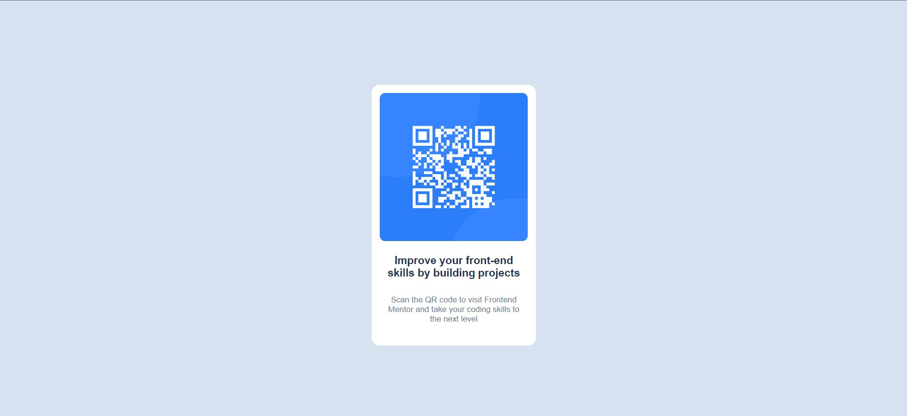

# Frontend Mentor - QR code component solution

This is a solution to the [QR code component challenge on Frontend Mentor](https://www.frontendmentor.io/challenges/qr-code-component-iux_sIO_H). Frontend Mentor challenges help you improve your coding skills by building realistic projects. 

## Table of contents

- [Overview](#overview)
  - [Screenshot](#screenshot)
  - [Links](#links)
- [My process](#my-process)
  - [Built with](#built-with)
  - [What I learned](#what-i-learned)
  - [Continued development](#continued-development)
  - [Useful resources](#useful-resources)
- [Author](#author)
- [Acknowledgments](#acknowledgments)

**Note: Delete this note and update the table of contents based on what sections you keep.**
git 
## Overview

QR Code Component Project
This project is a simple QR code component built using HTML and CSS. The design follows a clean and minimalistic approach to improve front-end skills by creating a reusable UI component. It is inspired by Frontend Mentor challenges to enhance coding skills by focusing on project-based learning.

Project Features
HTML5 Markup: The component is structured with semantic HTML5.
CSS Styling: Utilizes modern CSS for layout and design, including:
Custom fonts from Google Fonts (Outfit font family).
Flexbox for centering the component both vertically and horizontally.
Responsive layout suitable for various screen sizes.
Clean and elegant card-style design with border-radius for a rounded container.
Colors using HSL values for improved readability and design consistency.

File Structure
index.html: Contains the structure of the QR code component.
style.css: Contains all the styles used for the project layout, typography, and colors.
images/: 

How to Use
Clone or download this repository.
Open index.html in your browser to view the QR code component.

Tech Stack
HTML5
CSS3
 
### Screenshot

### Links

- Solution URL: [Add solution URL here](https://your-solution-url.com)
- Live Site URL: [Add live site URL here](https://your-live-site-url.com)

